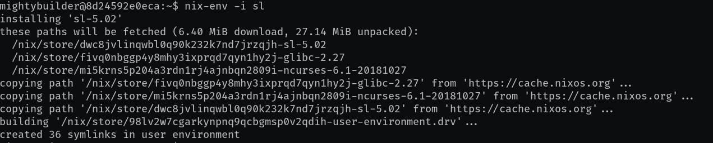

name: inverse
layout: true
class: center, middle, inverse
---

background-image: url(img/nix-snowflake.svg)
class: background

## Nix tutorial

.footnote[[CC BY 4.0](https://creativecommons.org/licenses/by/4.0/) licensed.
Browse slides at [tinyurl.com/nix-tutorial](https://tinyurl.com/nix-tutorial)]

---
layout: false

## Package managers

- Easybuild for HPC
- Pip for Python
- Cabal and Stack for Haskell
- Bundler for Ruby
- NPM for JavaScript

<p style="text-align:center;"></p>
<p style="clear: both;">

---

## Environment managers

- Version clashes?
- Library clashes?

<p style="text-align:center;"></p>
<p style="clear: both;">

---

## Installing Nix

```
docker run --privileged -it robertodr/ubuntu18.10_nix2.2.1
bash <(curl https://nixos.org/nix/install)
```
--- 

## User packages

__These packages will be always available for the current user__

- `nix --version`
- `nix search -u sl`
- `nix-env -i sl`
- `nix-env -e sl`

---
layout: false

## What happened?


- Packages are downloaded from the Nix cache
<p style="text-align:center;"></p>
<p style="clear: both;">
- The identity of the package is hashed: `dwc8jvlinqwbl0q90k232k7nd7jrzqjh`
- Package is copied to the _store_: `/nix/store/dwc8jvlinqwbl0q90k232k7nd7jrzqjh-sl-5.02`
- Symlinks appear in the user environment: `lrwxrwxrwx 1 mightybuilder mightybuilder 58 Jan  1  1970 /home/mightybuilder/.nix-profile/bin/sl -> /nix/store/dwc8jvlinqwbl0q90k232k7nd7jrzqjh-sl-5.02/bin/sl`


__Yes, but how to prevent clashes and ensure reproducibility?__

???

- Packages are built with a predefined toolchain for a variety of architectures. So it's almost always binaries.

---

## The Nix shell

- Create an (almost) isolated shell with GFortran installed: _impure shell_
```
nix-shell -p gfortran
```
- Create an isolated shell with GFortran installed: _pure shell_
```
nix-shell --pure -p gfortran
```
- Clean up when you're done
```
nix-collect-garbage -d
```

---

## More shells

Need more packages? Write a `shell.nix`

```
{ pkgs ? import <nixpkgs> { } }:

{
  dalton = pkgs.mkShell {
    name = "DALTON";
    buildInputs = with pkgs; [
      boost
      cmake
      gcc
      gfortran
      liblapackWithoutAtlas
      python3Packages.docopt
      python3Packages.jupyter
      python3Packages.matplotlib
      python3Packages.numpy
      python3Packages.pyyaml
      valgrind
      zlib
    ];
    hardeningDisable = [ "all" ];
  };
}
```

---

## Automate with `direnv`

`.envrc` file: `direnv` sets up the environment automatically

- Impure shell
```
use nix
```
- Pure shell
```
use nix --pure
```

`direnv` can be used with Python projects too!

- Python 3 virtual environment, then install packages with `pip`
```
layout python3
pip -r requirements.txt
```
- Python 3 environment, packages automatically installed from `Pipfile`
```
layout pipenv
```

---
name: last-page
template: inverse

Slideshow created using [remark] and served using [cicero]

Slides available on [GitHub](https://github.com/robertodr/nix-tutorial)

Browse slides at [http://tinyurl.com/nix-tutorial](http://tinyurl.com/nix-tutorial)

[remark]: https://github.com/gnab/remark
[cicero]: https://github.com/bast/cicero

